# System Diagrams

Here are the updated Mermaid diagrams for the TableTap system, reflecting the current codebase architecture.

## 1. User Interface Diagram (UI Map)
This diagram maps the application's routing structure, separating the Client (Diner) experience from the Admin/Staff Dashboard.

```mermaid
graph TD
    %% Main Entry Points
    Root((Root Entry)) --> LoginPath[/login / Login/]
    Root --> StaffLoginPath[/staff-login / Staff Login/]
    Root --> ClientEntry[/"?restaurant=X&table=Y" (QR Scan)/]
    
    %% Client Flow (ClientLayout)
    subgraph Client App
        ClientEntry --> CheckSession{Valid Session?}
        CheckSession -- No --> CheckSessionPage[Check Session / Verify Phone]
        CheckSession -- Yes --> ClientRoutes
        
        subgraph ClientRoutes [Authorized Client Routes]
            ClientMenu[Menu Page]
            ClientDetails[Menu Details]
            ClientItem[Item Details]
            ClientCart[Cart]
            ClientOrders[My Orders]
            ClientOrderDetails[Order Details]
            ClientSuccess[Order Success]
        end
        
        CheckSessionPage -.-> ClientMenu
    end

    %% Admin Flow (DashboardLayout)
    LoginPath --> AdminAuth{Authenticated?}
    StaffLoginPath --> AdminAuth
    AdminAuth -- Yes --> AdminDash[Admin Dashboard /]

    subgraph Admin Dashboard Modules
        AdminDash --> SysProfile[Profile & Settings]
        
        %% Product Management
        AdminDash --> ModProducts{Product Check}
        ModProducts --> ProdList[Products]
        ModProducts --> ProdAdd[Add Product]
        ModProducts --> ProdImg[Image Library]
        
        %% Category Management
        AdminDash --> ModCat{Category Check}
        ModCat --> CatList[Categories]
        ModCat --> CatAdd[Add Category]
        ModCat --> CatIcon[Icon Library]

        %% Order Management
        AdminDash --> ModOrders{Order Processing}
        ModOrders --> OrderList[Orders List]
        ModOrders --> OrderKanban[Kanban/View]
        ModOrders --> OrderHist[Order History]
        
        %% Quick Order (POS)
        AdminDash --> ModQuick{Quick Order}
        ModQuick --> QuickTakeaway[Takeaway Order]
        ModQuick --> QuickCheckout[Checkout]
        
        %% Reception & Tables
        AdminDash --> ModTable{Reception}
        ModTable --> TableView[Table View]
        ModTable --> TableBook[Book Table]
        ModTable --> TableOrder[Table Order]
        ModTable --> BillGen[Generate Bill]
        
        %% Staff & Roles
        AdminDash --> ModStaff{Staff Mgmt}
        ModStaff --> StaffList[Admin Manage]
        ModStaff --> StaffAdd[Add Staff]
        ModStaff --> RoleMgmt[Roles & Permissions]
    end

    %% Styling
    classDef client fill:#e1f5fe,stroke:#0277bd,stroke-width:2px;
    classDef admin fill:#fff3e0,stroke:#ef6c00,stroke-width:2px;
    classDef logic fill:#fcb,stroke:#333,stroke-width:1px,stroke-dasharray: 5 5;
    
    class ClientMenu,ClientCart,ClientOrders,CheckSessionPage client;
    class AdminDash,ProdList,OrderList,TableView,StaffList admin;
    class CheckSession,AdminAuth,ModProducts,ModCat,ModOrders,ModQuick,ModTable,ModStaff logic;
```

## 2. User Flow Diagram (Diner Experience)
This diagram illustrates the step-by-step flow for a diner scanning a QR code and placing an order.

```mermaid
sequenceDiagram
    participant User as 👤 User (Diner)
    participant ClientApp as 📱 Client App
    participant API as 🌐 Backend API
    participant Socket as 🔌 WebSocket

    Note over User, ClientApp: 1. Initialization
    User->>ClientApp: Scans QR Code (?restaurant=id&table=id)
    ClientApp->>API: GET /resturant-info/:id
    ClientApp->>API: GET /check-session/:tableId
    
    alt Session Exists (Valid)
        API-->>ClientApp: { session: true, phone: ... }
        ClientApp->>ClientApp: Auto-redirect to Menu
    else No Session
        API-->>ClientApp: { session: false }
        ClientApp-->>User: Show CheckSession Page
        User->>ClientApp: Enters Phone Number -> Verify
        ClientApp->>API: Verify OTP/Phone
        API-->>ClientApp: Success -> Create Session
        ClientApp->>ClientApp: Redirect to Menu
    end

    Note over User, ClientApp: 2. Ordering
    ClientApp->>API: GET /product/product/:restaurantId
    API-->>ClientApp: Return Menu Data
    ClientApp-->>User: Display Categories & Items
    
    User->>ClientApp: Add Item to Cart
    ClientApp->>ClientApp: Update Cart Context (Local)
    
    User->>ClientApp: Go to Cart -> Place Order
    ClientApp->>API: POST /order/create
    activate API
    API-->>ClientApp: Order Created (Pending)
    deactivate API
    
    ClientApp-->>User: Show "Order Success" Screen

    Note over API, Socket: 3. Staff Notification
    API->>Socket: Emit "new-order" event (Room: restaurantId)
    Socket->>ClientApp: (Admin Dashboard receives Details)
```



## 3. Order Status Lifecycle
Status flow for an order as it moves through the kitchen and billing.


